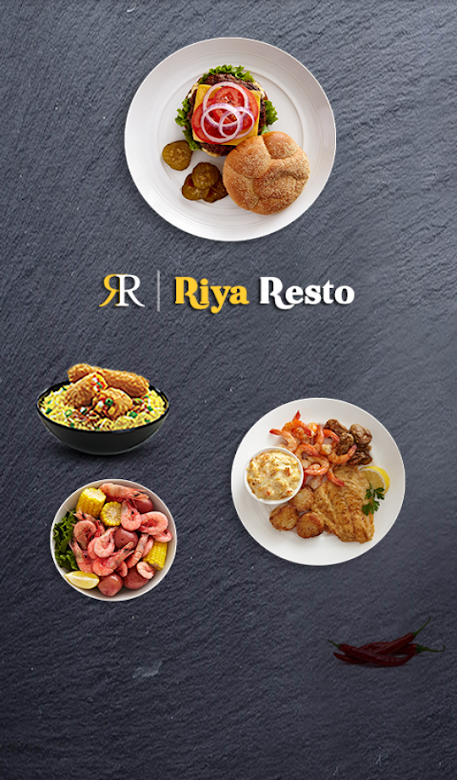
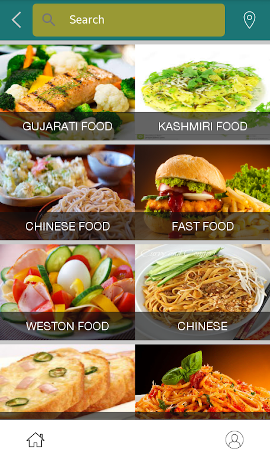
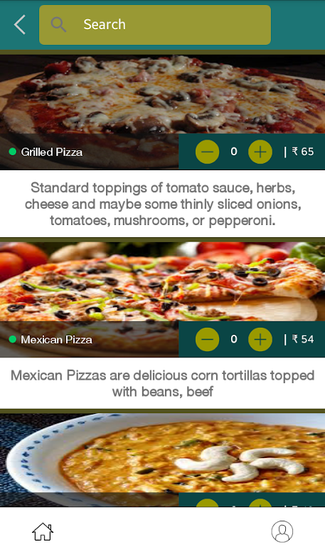
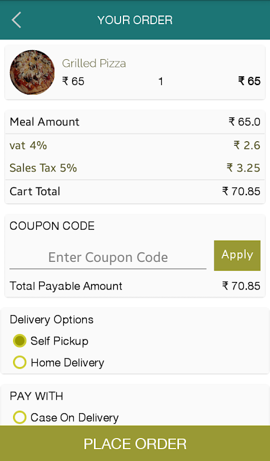

### Important
```
Under NDA sign, we can't public source and requirement documents, but you can check project under agreement.
```

# Riya Resto
A Complete Online Food Ordering System for your Restaurant.


```
Ultimate Benefits of Riya Resto Mobile App for Food Ordering & Dining
.
Our Riya Resto, a SaaS (Cloud) based web portal integrates and mobile applications are offering some distinctive advantages such as: We have system which can be installed at your server with standalone copy as well ASK for this.
Enough Options for Diners & Food Lovers
```

## Screenshots
    


## Description
Diners can get options for:
• Dine in-table booking/table reservation features for diners away or in vicinity
• Smart order taking features for-
• Takeaway/pickup foods directly from restaurants
• Home delivery of food orders by restaurants in vicinity
• One-Window Shop Experiences with Restaurant Billing Application
• Quick Search for a Menu or an Order
• Easy & Secure Payment Options
• Devoted to the Best User Experiences
• Lucrative Offers Managements
• One App for All Tasks
• Why Riya Resto the Best Choice as a Web & Mobile Platform for Restaurants?
• The Best Way to Reward Loyal Diners
• Easy to Use Ordering App for Restaurants
• Excellent Menu Management for Restaurants
• Comprehensive Inventory Management for Restaurants
• Efficient Supply Chain Management
• Golden Marketing Opportunity for Restaurants
• Push Notification Facilities

## TECHNOLOGIES
- React Native
- iOS & Android
- SaaS (Cloud) based web portal

## PLATFORM SUPPORT: IOS, ANDROID
- [App Store](https://apps.apple.com/us/app/riya-resto/id1174767440)
- [Google Play Store](https://play.google.com/store/apps/details?id=com.riya.resto&hl=en_US)


## Version History

### 1.1 Oct 4, 2017

- Minor bug fixes.

### 1.0 Nov 11, 2016

Initial publish

## License

```
Copyright (c) 2017 Addon Solutions

Permission is hereby granted, free of charge, to any person obtaining a copy
of this software and associated documentation files (the "Software"), to deal
in the Software without restriction, including without limitation the rights
to use, copy, modify, merge, publish, distribute, sublicense, and/or sell
copies of the Software, and to permit persons to whom the Software is
furnished to do so, subject to the following conditions:

The above copyright notice and this permission notice shall be included in all
copies or substantial portions of the Software.

THE SOFTWARE IS PROVIDED "AS IS", WITHOUT WARRANTY OF ANY KIND, EXPRESS OR
IMPLIED, INCLUDING BUT NOT LIMITED TO THE WARRANTIES OF MERCHANTABILITY,
FITNESS FOR A PARTICULAR PURPOSE AND NONINFRINGEMENT. IN NO EVENT SHALL THE
AUTHORS OR COPYRIGHT HOLDERS BE LIABLE FOR ANY CLAIM, DAMAGES OR OTHER
LIABILITY, WHETHER IN AN ACTION OF CONTRACT, TORT OR OTHERWISE, ARISING FROM,
OUT OF OR IN CONNECTION WITH THE SOFTWARE OR THE USE OR OTHER DEALINGS IN THE
SOFTWARE.
```
